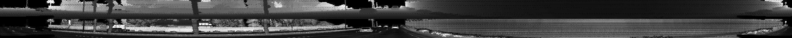

# SDCND : Sensor Fusion and Tracking

# Overview

Detect objects in Lidar point-cloud data from the Waymo Open Dataset. 
Perform fusion between Lidar and camera detections and track objects using an Extended Kalman Filter.
Implement data association and track management for the fusion solution.

The project consists of two main parts: 
1. **Object detection**: Extracting Lidar point-clouds from the Waymo data set, visualization, converting to a birds-eye view representation and 
executing a pre-trained NN on this data (FPN ResNet). Integrated a second NN and calculated
standard evaluation metrics to compare their performance.
2. **Object tracking** : An Extended Kalman Filter is used to track objects from both
Lidar and camera detections. Data association based on the Single Nearest Neighbour
method, track scoring and track management (initialization, confirmation, deletion), 
gating and field-of-view evaluation.

For a full description of the project and setup instruction please see the [original README.md](README_original.md)

Answers to the project questions are in [writeup.md](writeup.md)

Stucture of the Project:

# Solution - Lidar-Camera fusion and object tracking

Final tracking output, using both Lidar and camera detections, 
EKF filter and track management:

# Solution - Lidar object detection

## Object detection

Height and intensity extracted from Lidar range image:

Point cloud visualization using Open3D

3-channel BEV map containing density (red), height (green) and intensity (blue) data.

Integrated pre-trained FPN ResNet model for object detection 

Precision, recall and metrics calculated using Darknet and FPN ResNet for detection 

