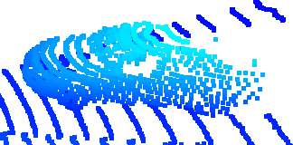
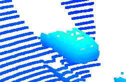
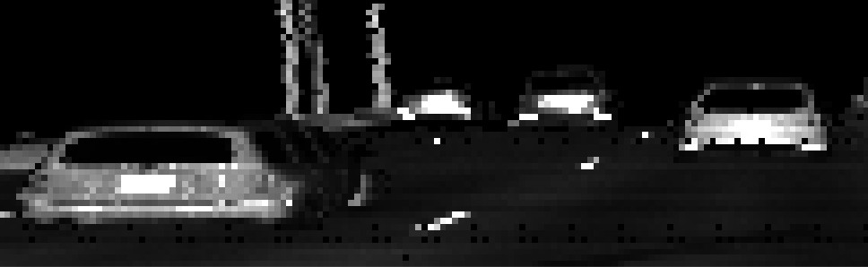

# Writeup: Track 3D-Objects Over Time (final project)

### 1. Write a short recap of the four tracking steps and what you implemented there (filter, track management, association, camera fusion). Which results did you achieve? Which part of the project was most difficult for you to complete, and why?

1. Filtering: Extended Kalman Filter for tracking of objects. A linear measurement model
for Lidar detections and a non-linear measurement function for camera detections, both
using sensor calibration information to correctly transform between vehicle and sensor
coordinate systems. A simple constant velocity model is used in the prediction step.
2. Track management: Initialization of new track from unassigned measurements,
track score calculation based on the number of successful detections in a fixed window
of past frames, taking into account sensor field-of-views.
Handling of 3 track states (init, tentative, confirmed) and deleting tracks based on hard-coded thresholds on
track scores and too large covariance values.
3. Association: Track and measurement association using the Mahalanobis distance, which
takes into account not just the L2 distance of the track and measurement means, 
but also the covariances.
4. Camera fusion: Transforming the KF state using a non-linear function into camera and
then image space.

The resulting system correctly tracks all valid and clearly visible objects in the
selected sample sequences with RMSE below the expected 0.25. Some false detections 
are visible and show unreasonable motion, which could be corrected with more conservative 
track initialization and/or stronger model assumptions (e.g. consistency between the
yaw and the direction of motion enforced, objects not allowed 'flying' over each other, etc).
Currently these tracks are deleted after a few frames due to not received reinforcement
from measurements.

The project was very well built and guided, I encountered no major difficulties.

### 2. Do you see any benefits in camera-lidar fusion compared to lidar-only tracking (in theory and in your concrete results)?

- Using Lidar provides a very solid base, but some information can only be detected using
cameras (e.g. turn lights and brake lights), so using both is essential. (not seen in the project)
- Using both modalities allows more aggressive pruning of invalid detections/tracks (seen in the project)

### 3. Which challenges will a sensor fusion system face in real-life scenarios? Did you see any of these challenges in the project?

- When one sensor detects an object and the other one does not detect it then it is difficult 
to decide which one to trust.
- In a single-hypothesis system if a mistake is made in an earlier frame (e.g. incorrectly
assigning a measurement with a track, resulting in incorrect state information) then recovering
from this is difficult, as the predicted and measured state may get very far away during
the next frames.

### 4. Can you think of ways to improve your tracking results in the future?

- All things in the standout suggestions could be implemented (e.g. using a bicycle model
instead of the current one or improved data association)
- Better track management
- Using all the available sensors to create 360 view
- Adding radar to directly measure velocity

# Writeup: Object detection (mid-term project)

### 2 examples of vehicles with high visibility

### 2 examples of vehicles with medium visibility

### 2 examples of vehicles with low visibility

### Features

A highly stable feature in the intensity image is the licence plate of the vehicles 
due to its material and bright color. It is not always available though, as in some areas 
vehicles do not need to carry licence plates both in the front/back. It is also not useful 
for detecting other types of objects (like bicycles).

